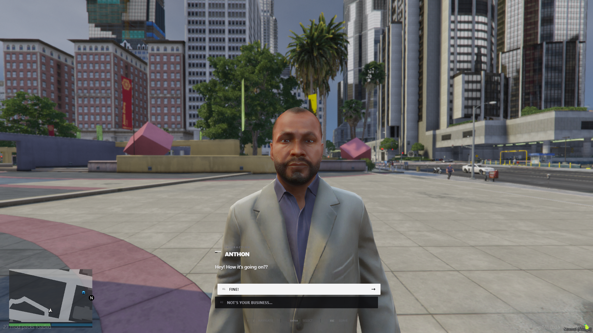
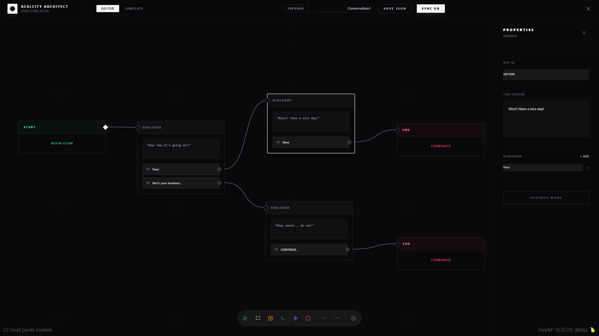
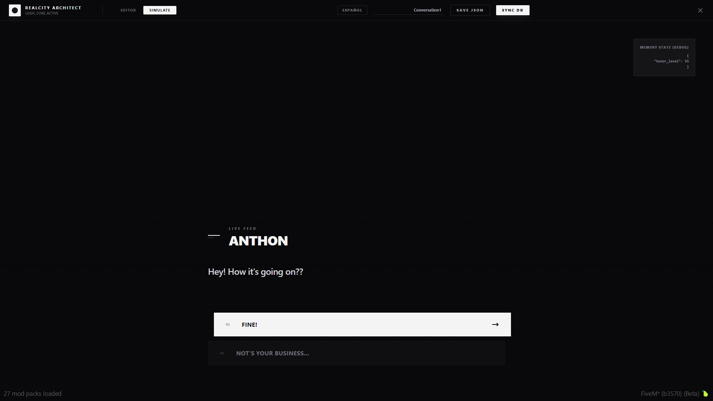

# RC Interactions



A modular interaction/dialogue system for FiveM featuring:
- A visual node-based editor (NUI) to design dialogue flows.
- An in-game runtime: spawns NPCs, provides a "Talk" interaction, and runs the flow.
- Framework support via Bridge (QBCore / ESX / Standalone).

---

## Table of Contents

- [Features](#features)
- [Requirements](#requirements)
- [Installation](#installation)
- [Configuration](#configuration)
- [Usage](#usage)
  - [Editor (NUI)](#editor-nui)
  - [Runtime (in-game)](#runtime-in-game)
  - [Dialogue Controls](#dialogue-controls)
  - [Call a flow from another script](#call-a-flow-from-another-script)
- [Database](#database)
- [Resource Structure](#resource-structure)
- [Screenshots / Images](#screenshots--images)
- [Contributing](#contributing)
- [License](#license)

---

## Features

- Visual editor to create projects and connect nodes (Start / Dialogue / Condition / Event / End).
- MySQL persistence (tables: `rc_interactions`, `rc_interaction_groups`).
- World NPCs defined by the `START` node (coords + model).
- Optional integration with `qb-target` or `ox_target` (via `Config.UseTarget`).
- Runtime dialogue UI with:
  - typewriter effect,
  - keyboard selection,
  - exit/cancel using `ESC`.
- Cinematic camera focusing the NPC during the conversation.
- Optional NPC speech/lipsync during dialogue (configurable).
---

## Requirements

- **FiveM** server (fxserver) with `fx_version cerulean`.
- **oxmysql** (required): the resource uses `@oxmysql/lib/MySQL.lua`.
- **MySQL / MariaDB**.
- (Optional) **qb-target** or **ox_target** if you want the "Talk" target interaction.
- For building the NUI (only if you modify the web UI): **Node.js**.

---

## Installation

1) **Place the resource**
- Copy the `rc-interactions` folder into your resources directory.
  - Example: `resources/[realcity]/rc-interactions`

2) **Ensure dependencies**
- Ensure `oxmysql` is installed and started.
- If you plan to use target interactions:
  - install and start `qb-target` or `ox_target`.

3) **Database**
- Import [interactions.sql](interactions.sql) (recommended).
- Alternatively, the resource attempts to create tables on start (see `server/main.lua`).

4) **Build the NUI (only if you changed the web UI or `web/dist` is missing)**
```bash
cd web
npm install
npm run build
```

5) **Start the resource**
In your `server.cfg`:
```cfg
ensure oxmysql
ensure rc-interactions
```

---

## Configuration

Edit [shared/config.lua](shared/config.lua).

| Option | Description | Example |
|---|---|---|
| `Config.Framework` | Framework (auto/qbcore/esx/standalone) | `auto` |
| `Config.Debug` | Debug logs | `true` |
| `Config.InteractionDistance` | Base interaction distance (if implementing proximity checks without target) | `3.0` |
| `Config.UseTarget` | Use qb-target / ox_target for interactions | `true` |
| `Config.EditorCommand` | Command to open the editor | `interactioneditor` |
| `Config.EditorGroup` | Group required to open the editor (Bridge) | `admin` |
| `Config.EnableNpcSpeech` | Enable/disable NPC speech/lipsync while talking | `true` |

---

## Usage

### Editor (NUI)

1) Join the server with a player that matches `Config.EditorGroup`.
2) Run the command configured in `Config.EditorCommand`.
3) Create a project, design the flow, and save.

**Permissions**
- The command triggers a server-side check: `rc-interactions:server:checkEditorPermissions`.
- If `Bridge.HasGroup(source, Config.EditorGroup)` is true, the editor opens.

**Spawning an NPC in the world**
- The runtime spawns an NPC when the `START` node has:
  - `data.coords` (x, y, z, w)
  - `data.model` (optional, defaults to `a_m_y_business_01`)

### Runtime (in-game)

- On resource start and sync, interactions are loaded and NPCs are spawned based on `START` coords.
- With target enabled (`Config.UseTarget = true`), you will see the **Talk** option.
- When interacting:
  - a camera is created and centered on the NPC,
  - the dialogue UI opens,
  - the NPC plays a talking animation,
  - optionally NPC speech/lipsync is played (see `Config.EnableNpcSpeech`).

### Dialogue Controls

- **Up/Down arrows**: navigate options.
- **Enter**: select option.
- **1-4**: quick select.
- **ESC**: leave/cancel the interaction.

---

### Call a flow from another script

You can start a saved interaction (project) by its UUID from other client or server scripts.

- Client (Lua) — export (returns boolean):
```lua
local ok = exports['rc-interactions']:StartInteractionById('your-project-uuid')
if not ok then print('Interaction not found') end
```

- Client (event) — trigger locally:
```lua
TriggerEvent('rc-interactions:client:startInteractionById', 'your-project-uuid')
```

- Server → Client (recommended when starting for a specific player):
```lua
-- server-side
local targetPlayer = 123 -- player server id
TriggerClientEvent('rc-interactions:client:startInteractionById', targetPlayer, 'your-project-uuid')
```

Notes:
- The `projectId` is the UUID shown in the editor and stored in the `rc_interactions` table.
- The client `export` is a client-side function; call it from client scripts or use the server-to-client event when initiating from the server.
- If you want to start the interaction for all players, use `-1` as the target in `TriggerClientEvent`.


## Database

Tables (see [interactions.sql](interactions.sql)):
- `rc_interaction_groups`: project grouping.
- `rc_interactions`: stores the flow as JSON in `data` and a stable `uuid`.

The resource also attempts to ensure tables exist on startup (see `server/main.lua`).

---

## Resource Structure

- `fxmanifest.lua`: resource definition + NUI page.
- `shared/config.lua`: global configuration.
- `bridge/`: framework adapters (QBCore/ESX/Standalone/Auto).
- `server/`: permissions, saving/loading, and syncing.
- `client/main.lua`: editor open/close (NUI visibility).
- `client/runtime.lua`: NPC spawn, target interaction, flow execution, and runtime UI.
- `web/`: React app (editor/simulation/runtime UI) and the compiled build in `web/dist`.

---

## Screenshots / Images

### In-game dialogue (NUI)


### Dashboard


### Node editor



### Web simulation



---

## Contributing

Pull requests are welcome.

1) Branching
- Create a branch like `feature/my-change` or `fix/my-fix`.

2) Guidelines
- Keep changes small and focused.
- If you modify the web UI, always rebuild `web/dist`.

3) Web build (if you changed `web/`)
```bash
cd web
npm install
npm run build
```

4) Pull request
- Describe the problem, solution, and testing steps.
- Add screenshots if UI changes.

---

## License

This project is licensed under the PolyForm Noncommercial License 1.0.0 (code-specific, non-commercial).

Key points:
- Non-commercial only: you may not use this software for commercial purposes without a separate commercial license from the copyright holder.
- Attribution/Notices: retain copyright notices and this license in source distributions.

Full legal text: https://polyformproject.org/licenses/noncommercial/1.0.0/

Recommended attribution example:

- rc-interactions — A modular interaction/dialogue system for FiveM
- Author: xbymarcos
- Source: https://github.com/xbymarcos/rc-interactions
- Licensed under PolyForm Noncommercial 1.0.0 — https://polyformproject.org/licenses/noncommercial/1.0.0/